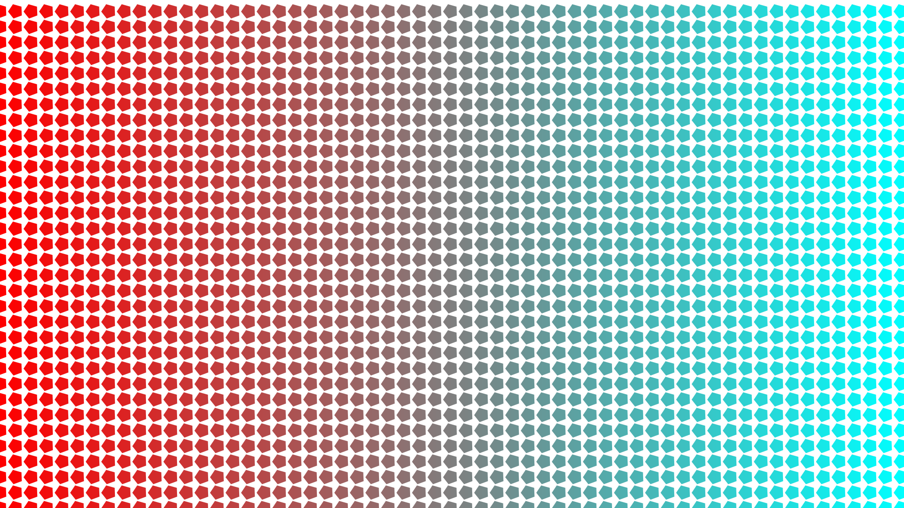
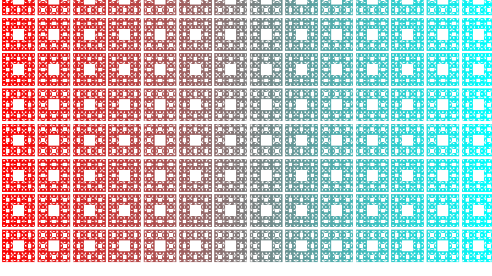
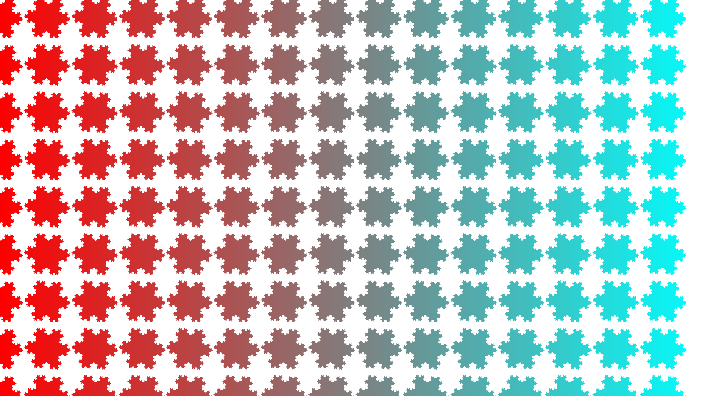
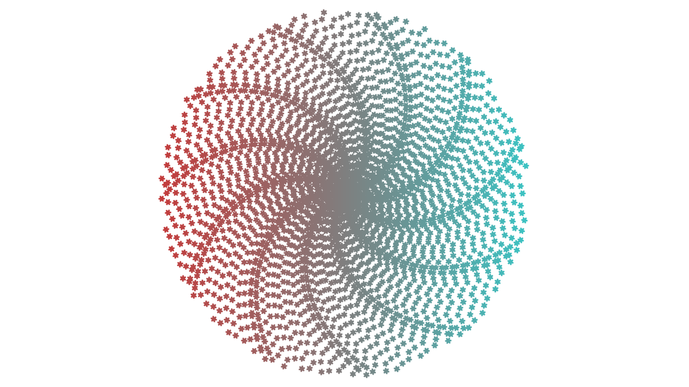
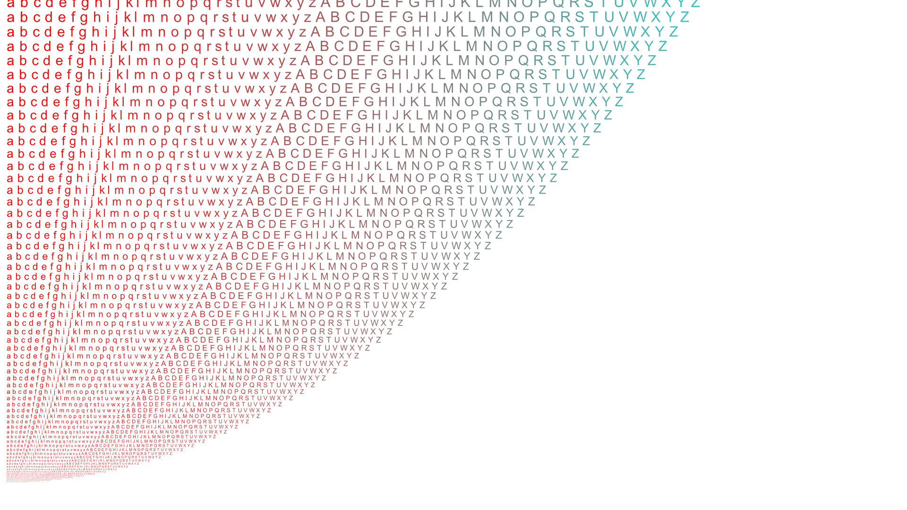

# Green Vector Graphics

This project is a vector graphics rendering core, licensed under the GPLv3 license.
It is indented to be forked by anyone and further implemented into a usable API.
It's core is extremely small and simple, and uses a simple technique for filling paths, using
the Green's theorem for area.

Along with the simple core, this project includes 5 animation examples.
These examples use a simple RGBA-float surface type, which is a C++ class inherited from the core class.
This extension works with a shader type, which compute colors for each pixel.
Two shaders are defined, a solid color shader, and a horizontal gradient shader.

The examples use freeglut to render the animations and stbi_image_write to save as png.

There are 5 examples located in ```examples/ex*.cpp```.

- Example 1: 1947 rotating pentagons
    - 
    - Average FPS: 93.509377

- Example 2: 112 moving sierpinsky carpets (4 iterations)
    - 
    - Average FPS: 

- Example 3: 135 rotating koch snowflakes (4 iterations)
    - 
    - Average FPS: 98.024338

- Example 4: 3000 moving smaller koch snowflakes (3 iterations)
    - 
    - Average FPS: 86.779381

- Example 5: 3328 moving letters
    - 
    - Average FPS: 109.656380

Note about the above performance tests:
```
All paths are polygonal
All rendering is done in CPU in a single thread
(The image data is sent to opengl+freeglut via ```glDrawPixels```)
Resolution: 1920x1080
Format: RGBA (float)
Processor: Intel Core i5-9300H CPU @ 2.40GHz
OS: Windows 11
```

# Pipeline

greenvg's core pipeline is simple.

A polygonal path is "sketched" into the core buffer.
This buffer is used to compute a pixel's signed coverage area by the path.
The order of the lines sketched are irrelevant, but the order of the endpoints
are relevant.

The path can be filled by computing the pixels' coverage area, using the Green's theorem.
The area is signed. Anticlockwise paths add area, and clockwise paths subtract area. Use negative paths to create holes.
The area can be used arbitrarily when painting a surface. 

# Method explanation
A detailed explanation of the method is in ```green.pdf```